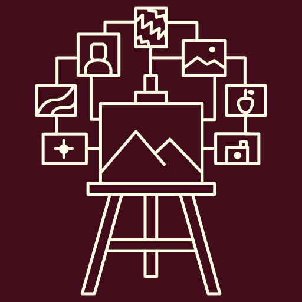

# Referentia



<a href="./LICENSE"></a>
<a href="https://github.com/gabrielzschmitz/Motrix"></a>

**Referentia** is a cross-platform visual reference canvas. Drop in the images
you collect while working, and the app keeps them organised on an infinite
pannable board so you can find them again and drag them straight into whatever
else you are drawing in.

It is built with **raylib** and powered by
**[Motrix](https://github.com/gabrielzschmitz/Motrix)**, a minimal Entity
Component System designed for high-performance interactive applications.

---

## Quick Start

### 1. Clone the repository

```sh
git clone https://github.com/gabrielzschmitz/referentia.git Referentia
cd Referentia
```

### 2. Build and run

<details open>
<summary><b>Automatic</b> &mdash; <code>./build.sh</code></summary>

Generates the makefiles, builds, and launches the app:

```sh
./build.sh
```

| Flag | Effect |
| --- | --- |
| `--debug` | Debug build: assertions and `LOG_DEBUG` output on |
| `--no-run` | Build only, do not launch |
| `--web` | Build for the browser with Emscripten, then serve it |
| `--web-port N` | Port for `--web` to serve on (default: 8000) |
| `--clean` | Full clean first (also wipes raylib, so it is slow) |
| `--no-regen` | Skip makefile generation |
| `-j, --jobs N` | Parallel job count (default: all cores) |

</details>

<details>
<summary>Manual &mdash; premake5 + make</summary>

For Windows, macOS or a custom toolchain, see
[INSTALL.md](INSTALL.md) for the full platform matrix.

```sh
cd build && ./premake5 gmake && cd ..
make config=release_x64 -j$(nproc)
./bin/Release/referentia
```

Builds land in `bin/<Config>/`. Other configurations: `debug_x64`,
`release_x86`, `debug_x86`, `debug_arm64`, `release_arm64`.

<details>
<summary>Web &mdash; <code>./build.sh --web</code></summary>

Needs an activated [Emscripten SDK](INSTALL.md#web-build-emscripten)
(`source emsdk_env.sh`):

```sh
./build.sh --web
```

This generates the Emscripten makefiles, runs `emmake make config=release_web`,
and serves the result on <http://localhost:8000/>. It is served over HTTP rather
than opened as a file because browsers refuse to load the `.wasm` sidecar over
`file://` — the page appears and then fails to start with an error that has
nothing to do with the build.

`--debug --web` builds the debug wasm target, and `--no-run` stops after the
build.

</details>

### 3. Run the tests

<details open>
<summary><b>Automatic</b> &mdash; <code>./tests.sh</code></summary>

```sh
./tests.sh
```

| Flag | Effect |
| --- | --- |
| `--debug` | Debug build of the tests |
| `--bench` | Also run the ECS/SparseSet benchmarks |
| `--list` | List the registered tests and exit |
| `--clean` | Clean the test project first |

The tests link no raylib, so this never builds raylib: a clean run takes about
two seconds.

</details>

<details>
<summary>Manual &mdash; premake5 + make</summary>

```sh
cd build && ./premake5 gmake && cd ..
make config=release_x64 referentia-tests
./bin/Release/referentia-tests
```

The test binary needs no GPU, no display and no X11 server, so it runs fine in
CI. It exits non-zero if any test fails.

</details>

---

## Features

* Infinite pan/zoom reference board
* **Image nodes**: drop images on the window, or use *Open image…* on the board
  panel, to place a reference on the board. PNG, JPEG, BMP, TGA, GIF, QOI and
  DDS, on every platform including the browser.
* Move, rotate and straighten a node with the mouse: drag the image to move it,
  drag a corner to turn it, or double-click it to put it back upright.
* Board panel (F10), frame-rate readout (F11), frame-time graph (F8) and
  timestamped screenshots (F12)

Not built yet: resizing an image node, animated GIF playback, text nodes, group
frames, auto-arrange, and saving a board. Image nodes are session-only —
everything imported lives in memory and is gone when the app closes.

### Where images land

A node is placed at one image pixel per world unit, centred on where you dropped
it (or on the middle of the view if it came from the dialog), so at zoom 1 a
400&times;300 image is exactly 400&times;300 world units and lines up with the
grid. The longest side is capped at 2000 units so a 4000&nbsp;px phone photo
still lands somewhere you can find, and is only ever scaled *down*: a 64&times;64
icon stays 64&times;64 rather than being blown up and blurred.

### Moving and turning an image

A node draws a border and four corner handles, and the left button works on
them. Drag the image to move it, drag a corner to turn it around its centre, and
double-click the image to straighten it — the reset is a click rather than a
drag, so straightening does not require aiming at anything.

The right button turns a node too, and it needs no corner: press anywhere on
the image and swing the pointer around its centre, and it turns by however far
the pointer has swung. That is the gesture for a rough angle, which is what most
rotations are, and the corner handles are for the ones that have to be exact.

Panning is on the middle button or space+left, deliberately not on a bare left
drag, so that a left drag is never ambiguous between moving the board and moving
an image.

### Platform notes

| | Drop | Dialog |
| --- | --- | --- |
| Windows | yes | COM `IFileOpenDialog` |
| macOS | yes | `NSOpenPanel` |
| Linux (X11/Wayland) | yes | GTK 3, else `zenity`/`kdialog` |
| Browser | yes, as bytes | the browser's file input |
| raylib `PLATFORM_DESKTOP_WIN32` / `RGFW` | **no** | yes |

The last row is a raylib limitation, not a Referentia one: file drop is a GLFW
feature, and those two backends do not implement it. `./build.sh --web` and the
default desktop builds both use GLFW, so this only affects a build made with
`--platform` set to one of them. The app says so at startup and in `--help`
rather than leaving drag and drop silently inert.

On Linux, a build without `libgtk-3-dev` falls back to `zenity` or `kdialog` at
runtime if either is installed; the native dialog is used whenever premake found
GTK 3 at build time. There is no console prompt fallback, so a build with none of
the three says so instead.

## Project Structure

```text
build/      # premake5 build scripts and the downloaded raylib checkout
include/    # shared third-party headers
resources/  # icons and fonts
scripts/    # packaging / release tooling, and the build.sh helpers
src/        # C++ sources
├── app/     # application lifecycle, board wiring, platform entrypoints
├── board/   # pure camera/transform maths (headless, unit tested)
├── components/ # component definitions
├── entities/# reusable entity factories
├── engine/  # ECS core, generic systems, and the UI toolkit
├── systems/ # per-frame update and render passes
└── tests/   # unit tests and benchmarks
```

`build.sh` and `tests.sh` sit at the repository root.

### Architecture

Referentia uses [Motrix](https://github.com/gabrielzschmitz/Motrix) as its ECS
backbone:

* **Entities** are references, groups, and the board itself
* **Components** store transform, metadata and interaction state
* **Systems** update the board, nodes, groups and layout independently

There is exactly one board and no scene registry: `app/board.h` holds the four
functions the app loop calls (`BoardInit`, `BoardUpdate`, `BoardRender`,
`BoardCreateUI`). A second board mode would reintroduce a dispatch table at
that point, when there would be something to dispatch to.

Namespaces are split by reuse: `motrix::engine` is the vendored ECS and generic
engine utilities, `referentia::*` is everything specific to this application.

The board is deliberately **flat**. A node carries a list of tags, and a group
is a frame that is rendered around every node tagged with the group's name.
There is no parent/child hierarchy, so moving a member can never invalidate a
frame, the frame simply re-fits to its members each frame unless it is pinned.

---

## License

This project is licensed under the MIT License. See the [LICENSE](LICENSE) file
for details.

### Third-Party

* **Work Sans**: SIL Open Font License 1.1. All nine statics (Thin
  through Black, upright and italic) are bundled; see
  [`resources/fonts/OFL.txt`](resources/fonts/OFL.txt).

